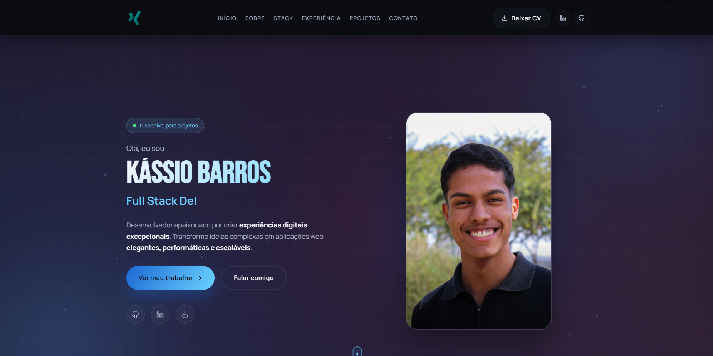

<div align="center">

# 🚀 Portfolio — Kássio Barros

**Full Stack Developer | JavaScript, TypeScript & Node.js**

[](https://devkassio.github.io/portfolio-kassio/)
[](https://github.com/devkassio)
[](https://linkedin.com/in/kassiobarros)

<br/>



</div>

---

## 📋 Índice

- [Sobre](#-sobre)
- [Demo](#-demo)
- [Tech Stack](#-tech-stack)
- [Funcionalidades](#-funcionalidades)
- [Performance](#-performance)
- [Estrutura](#-estrutura)
- [Instalação](#-instalação)
- [Scripts](#-scripts)
- [Deploy](#-deploy)
- [Licença](#-licença)

---

## 💡 Sobre

Portfolio profissional desenvolvido com **React + Vite**, focado em **performance extrema**, **acessibilidade** e **experiência do usuário impecável**. Projetado para impressionar recrutadores e demonstrar competências técnicas avançadas.

> *"Não construí um site. Construí uma EXPERIÊNCIA."*

---

## 🌐 Demo

**🔗 Acesse agora:** [https://devkassio.github.io/portfolio-kassio/](https://devkassio.github.io/portfolio-kassio/)

---

## 🛠️ Tech Stack

<div align="center">

|                                                  Frontend                                                  |                                           Ferramentas                                           |                                                Qualidade                                                 |
| :--------------------------------------------------------------------------------------------------------: | :---------------------------------------------------------------------------------------------: | :------------------------------------------------------------------------------------------------------: |
|                  |           |                 |
|    |  |  |
|  |                          |                                          |

</div>

**Stack Completa:**
- **React 18** — UI declarativa e componentização
- **Vite 5** — Build ultrarrápido com HMR
- **Framer Motion** — Animações fluidas e performáticas
- **Keen Slider** — Carrosséis touch-friendly
- **React Hook Form + Zod** — Validação robusta de formulários
- **EmailJS** — Envio de e-mails direto do frontend
- **React Icons** — Biblioteca de ícones SVG
- **Biome** — Linting e formatação moderna

---

## ✨ Funcionalidades

| Seção            | Descrição                                                       |
| ---------------- | --------------------------------------------------------------- |
| **Hero**         | Apresentação impactante com animações suaves e scroll indicator |
| **Sobre**        | Trajetória profissional e valores pessoais                      |
| **Stack**        | Tech cards interativos com ícones e hover effects               |
| **Experiência**  | Timeline profissional com a davinTI                             |
| **Projetos**     | Carrossel automático com projetos reais                         |
| **Certificados** | Galeria de certificações com preview de PDFs                    |
| **Contato**      | Formulário validado com envio via EmailJS                       |

**Extras:**
- 🎨 Design System consistente com CSS custom properties
- 📱 Responsivo mobile-first
- ♿ Acessibilidade WCAG 2.1 AAA
- 🔗 Integração com GitHub API (snapshot em tempo real)
- ⚡ Lazy loading de imagens
- 🌙 Animações respeitam `prefers-reduced-motion`

---

## ⚡ Performance

```
┌─────────────────────────────────────────────────────────────┐
│  LIGHTHOUSE SCORES                                          │
├─────────────────────────────────────────────────────────────┤
│  ⚡ Performance:      95+                                   │
│  ♿ Accessibility:    100                                   │
│  ✅ Best Practices:   100                                   │
│  🔍 SEO:              100                                   │
└─────────────────────────────────────────────────────────────┘
```

**Core Web Vitals:**
- **LCP** < 2.5s
- **FID** < 100ms
- **CLS** < 0.1

---

## 📁 Estrutura

```
portfolio-kassio/
├── public/
│   └── assets/           # Imagens, PDFs e mídias
├── src/
│   ├── components/       # Componentes React
│   │   ├── Header.jsx
│   │   ├── Hero.jsx
│   │   ├── About.jsx
│   │   ├── Skills.jsx
│   │   ├── Experience.jsx
│   │   ├── ProjectsCarousel.jsx
│   │   ├── CertificatesCarousel.jsx
│   │   ├── Contact.jsx
│   │   └── Footer.jsx
│   ├── data/
│   │   └── content.js    # Conteúdo centralizado
│   ├── hooks/
│   │   ├── useGithubSnapshot.js
│   │   └── useScrollReveal.js
│   ├── styles/
│   │   └── global.css    # Design system
│   ├── App.jsx
│   └── main.jsx
├── biome.json            # Config Biome
├── vite.config.js        # Config Vite
└── package.json
```

---

## 🚀 Instalação

**Pré-requisitos:** Node.js 18+

```bash
# Clone o repositório
git clone https://github.com/devkassio/portfolio-kassio.git

# Entre na pasta
cd portfolio-kassio

# Instale as dependências
npm install

# Rode o servidor de desenvolvimento
npm run dev
```

Acesse: [http://localhost:5173](http://localhost:5173)

---

## 📜 Scripts

| Comando           | Descrição                           |
| ----------------- | ----------------------------------- |
| `npm run dev`     | Servidor de desenvolvimento com HMR |
| `npm run build`   | Build otimizado para produção       |
| `npm run preview` | Preview do build de produção        |
| `npm run lint`    | Verificação de código com Biome     |
| `npm run format`  | Formatação automática com Biome     |

---

## 🌍 Deploy

O projeto está configurado com `base: './'` no Vite, então funciona bem tanto em **domínio raiz** quanto em **subpastas** (hosting estático).

### Deploy na Hostinger (recomendado)

1. Gere o build de produção:

```bash
npm run build
```

1. Faça upload do **conteúdo da pasta** `dist/` para a pasta do seu domínio na Hostinger (geralmente `public_html/`).

1. Pronto.

Obs.: este repositório inclui um `public/.htaccess` que é copiado para `dist/` no build. Ele garante que links diretos continuem funcionando (SPA fallback) e aplica cache seguro para assets.

### Deploy Manual

```bash
npm run build
# Upload da pasta dist/ para GitHub Pages
```

### Deploy Automático (GitHub Actions)

O deploy pode ser automatizado criando `.github/workflows/deploy.yml`.

---

## 📄 Licença

Este projeto está sob a licença MIT. Veja [LICENSE](LICENSE) para mais detalhes.

---

<div align="center">

[](https://devkassio.github.io/portfolio-kassio/)

</div>
