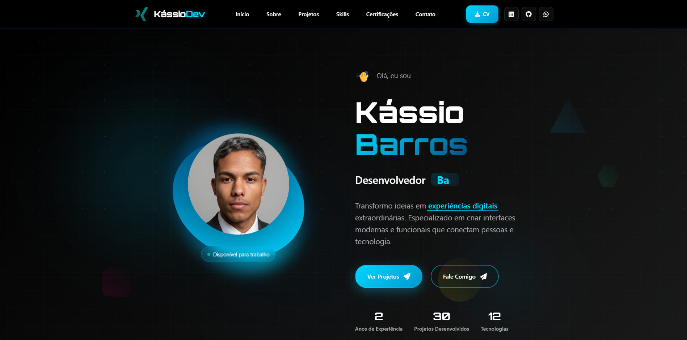

# 🚀 Portfolio Extraordinário - Kássio Barros# 💻 Portfólio

<div align="center">Bem-vindo ao meu portfólio! 🚀

Sou **Kássio Barros**, desenvolvedor **Full Stack Júnior**, apaixonado por tecnologia, código limpo e por transformar ideias em aplicações reais e funcionais.

[](https://devkassio.github.io/portfolio-kassio/)Aqui você encontra meus principais projetos, habilidades e formas de contato.

[](https://linkedin.com/in/kassiobarros)

[](https://github.com/devkassio)🔗 **Acesse meu portfólio online:** [devkassio.github.io/portfolio-kassio](https://devkassio.github.io/portfolio-kassio/)

📦 **GitHub:** [github.com/devkassio](https://github.com/devkassio)



---

</div>

## 🧠 Sobre mim

## 🎯 Sobre o Projeto

Sou um desenvolvedor em constante evolução, com experiência prática na criação de **aplicações web completas**, do **front-end** ao **back-end**.

Este é o meu **portfólio pessoal extraordinário**, desenvolvido do zero com tecnologias modernas e design futurístico. Uma experiência imersiva que demonstra minhas habilidades como **Desenvolvedor Full Stack** através de animações avançadas, efeitos visuais impressionantes e funcionalidades interativas.Domino as principais tecnologias da stack JavaScript moderna e estou sempre buscando aperfeiçoar minha lógica, arquitetura de código e performance.

### 🌟 Características Principais💡 Tenho como foco o desenvolvimento de soluções escaláveis e bem estruturadas, aplicando boas práticas e mantendo um aprendizado contínuo.

- ✨ **Design Futurístico** com efeitos de glassmorphism e animações fluidas---

- 🎨 **Interface Responsiva** adaptável a todos os dispositivos

- 🔥 **Animações Avançadas** com CSS keyframes e JavaScript## 🚀 Tecnologias e Habilidades

- 📱 **PWA Ready** - Pronto para instalação como aplicativo

- 🌙 **Efeitos Visuais** com partículas, gradientes e backdrop filters**Linguagens & Frameworks:**

- 📊 **Integração GitHub API** para exibição dinâmica de projetosHTML5 • CSS3 • JavaScript (ES6+) • TypeScript • Node.js • Express.js • React

- 📧 **Sistema de Contato** funcional com EmailJS

- 🔍 **Lightbox Interativo** para certificações**Banco de Dados:**

- 🎛️ **Filtros Dinâmicos** para projetos e certificaçõesPostgreSQL • MySQL • Prisma ORM

## 🛠️ Tecnologias Utilizadas**APIs & Integrações:**

RESTful APIs • JSON • Postman • HTTPie

<div align="center">

**Automação & No-Code:**

### Frontendn8n


**Controle de Versão:**

Git • GitHub

### Ferramentas & APIs**Soft Skills:**

Transparência • Proatividade • Comunicação Clara • Foco em Resultados • Aprendizado Contínuo


---


## 🧩 Projetos em Destaque

</div>

### 🍔 [DevBurger](https://github.com/devkassio/DevBurger)

## 🎨 Seções do PortfolioAplicação Full Stack que simula um sistema de pedidos de lanchonete, com front-end em React (Vite) e back-end em Node.js/Express.

Inclui integração com banco de dados e interface responsiva.

### 🏠 **Hero Section**

- Apresentação pessoal com efeitos de typing animado### 🛍️ [DevStore](https://github.com/devkassio/DevStore)

- Estatísticas dinâmicas com contadoresLoja virtual desenvolvida com HTML, CSS e JavaScript, focada em UI/UX e responsividade.

- Botões de ação com efeitos hover avançados

- Indicador de scroll interativo### ☕ [Starbucks Coffee One](https://github.com/devkassio/StarbucksCoffeeOne)

Landing page inspirada na marca Starbucks, desenvolvida com design moderno e efeitos visuais em CSS.

### 👨‍💻 **Sobre Mim**

- Layout em cards com efeitos glassmorphism### 🎯 [FP Selection](https://github.com/devkassio/FP-SELLECTION)

- Informações sobre transição de carreiraProjeto web de seleção interativa com JavaScript puro, explorando manipulação do DOM e lógica de interação.

- Links para redes sociais

- Imagem de perfil com animações---

### 🚀 **Projetos**## 🎓 Formação

- Sistema de filtros por categoria (Frontend, Full Stack, Design)

- Cards interativos com overlay de ações📘 **Curso Full Stack Pro – DevClub** _(conclusão prevista: abril de 2026)_

- Integração com GitHub API para projetos dinâmicosFormação prática em desenvolvimento web com **HTML, CSS, JavaScript, TypeScript, React, Node.js, Express** e **bancos de dados relacionais**.

- Badges coloridos por tecnologia

- Links diretos para demo e código---

### 💡 **Habilidades**## 📬 Contato

- Grid responsivo de tecnologias

- Ícones com cores autênticas das tecnologias📧 **E-mail:** [kassioxis@icloud.com](mailto:kassioxis@icloud.com)

- Efeitos hover personalizados💼 **LinkedIn:** [linkedin.com/in/kassiobarros](https://linkedin.com/in/kassiobarros)

- 12+ tecnologias dominadas💻 **GitHub:** [github.com/devkassio](https://github.com/devkassio)

🌐 **Portfólio:** [devkassio.github.io/portfolio-kassio](https://devkassio.github.io/portfolio-kassio/)

### 🏆 **Certificações**

- Lightbox interativo para visualização---

- Sistema de filtros (Frontend, Backend, Eventos)

- 6+ certificados do DevClub⭐ _“Transformar curiosidade em código, e código em impacto real.”_

- Navegação entre imagens— **Kássio Barros**

### 📧 **Contato**

- Formulário funcional com EmailJS
- Validação de campos em tempo real
- Múltiplas formas de contato
- Design futurístico

## 🚀 Como Executar

1. **Clone o repositório**

```bash
git clone https://github.com/devkassio/portfolio-kassio.git
```

2. **Navegue até a pasta**

```bash
cd portfolio-kassio
```

3. **Abra o projeto**

```bash
# Usando Live Server (VS Code)
# Ou simplesmente abra o index.html no navegador
open index.html
```

## 📱 Responsividade

O portfolio é totalmente responsivo e otimizado para:

- 📱 **Mobile** (320px - 768px)
- 📱 **Tablet** (768px - 1024px)
- 💻 **Desktop** (1024px+)
- 🖥️ **Large Screens** (1440px+)

## 🌟 Funcionalidades Especiais

### 🎯 **Animações CSS Avançadas**

- Partículas flutuantes
- Gradientes animados
- Efeitos de hover 3D
- Transições suaves

### 🔧 **JavaScript Interativo**

- Efeito de typing dinâmico
- Contadores animados
- Filtros em tempo real
- Scroll suave entre seções

### 🎨 **Design System**

- Paleta de cores consistente
- Tipografia moderna
- Componentes reutilizáveis
- Efeitos glassmorphism

## 📊 Estatísticas do Projeto

- 📁 **+5000 linhas** de código CSS customizado
- ⚡ **+700 linhas** de JavaScript vanilla
- 🎨 **50+ animações** CSS personalizadas
- 📱 **100% responsivo** em todos os dispositivos
- 🚀 **Performance otimizada** com lazy loading

## 🎯 Projetos em Destaque

### 🎨 **FP Carros Selection**

Sistema de seleção dinâmica com troca de cores, backgrounds e imagens. Interface moderna com interatividade avançada em JavaScript puro.

- **Demo:** [FP Selection](https://devkassio.github.io/FP-SELLECTION/)
- **Tecnologias:** HTML5, CSS3, JavaScript

### 💈 **Barbearia RP**

Website futurista para barbearia com animações imersivas, navegação fluida e identidade visual que une tradição e tecnologia de ponta.

- **Demo:** [Barbearia RP](https://devkassio.github.io/barbearia/)
- **Tecnologias:** HTML5, CSS3, JavaScript, UI/UX

### 🌟 **Portfolio Kassio**

Este próprio portfólio! Uma demonstração completa de habilidades em desenvolvimento frontend com design futurístico e experiência imersiva.

- **Live:** [Portfolio Live](https://devkassio.github.io/portfolio-kassio/)
- **Tecnologias:** HTML5, CSS3, JavaScript, EmailJS

## 🎓 Certificações

- 🏆 **HTML5 & CSS3** - DevClub (2025)
- 🏆 **JavaScript Fundamental** - DevClub (2025)
- 🏆 **JavaScript Avançado** - DevClub (2025)
- 🏆 **CSS Avançado** - DevClub (2025)
- 🏆 **Node.js** - DevClub (2025)
- 🏆 **Evento Nike** - DevClub (2025)

## 🛠️ Habilidades Técnicas

**Frontend:**

- HTML5, CSS3, JavaScript (ES6+)
- TypeScript, React, Next.js
- Responsive Design, CSS Grid/Flexbox
- Animações CSS, Glassmorphism

**Backend:**

- Node.js, Express.js
- MongoDB, APIs REST
- Postman, n8n

**Ferramentas:**

- Git, GitHub, VS Code
- Font Awesome, EmailJS
- Figma (básico)

## 🤝 Contribuições

Contribuições são sempre bem-vindas! Se você tem sugestões de melhorias:

1. Faça um fork do projeto
2. Crie uma branch para sua feature (`git checkout -b feature/AmazingFeature`)
3. Commit suas mudanças (`git commit -m 'Add some AmazingFeature'`)
4. Push para a branch (`git push origin feature/AmazingFeature`)
5. Abra um Pull Request

## 📞 Contato

**Kássio Barros** - Desenvolvedor Full Stack em transição de carreira

[](mailto:kassioxis@icloud.com)
[](https://linkedin.com/in/kassiobarros)
[](https://devkassio.github.io/portfolio-kassio/)
[](https://wa.me/16992715614)

## 📄 Licença

Este projeto está sob a licença MIT. Veja o arquivo [LICENSE](LICENSE) para mais detalhes.

---

<div align="center">

### 🌟 **"Transformando ideias em experiências digitais extraordinárias"** 🌟

**Feito com 💙 por [Kássio Barros](https://github.com/devkassio)**

[](https://devkassio.github.io/portfolio-kassio/)

</div>
